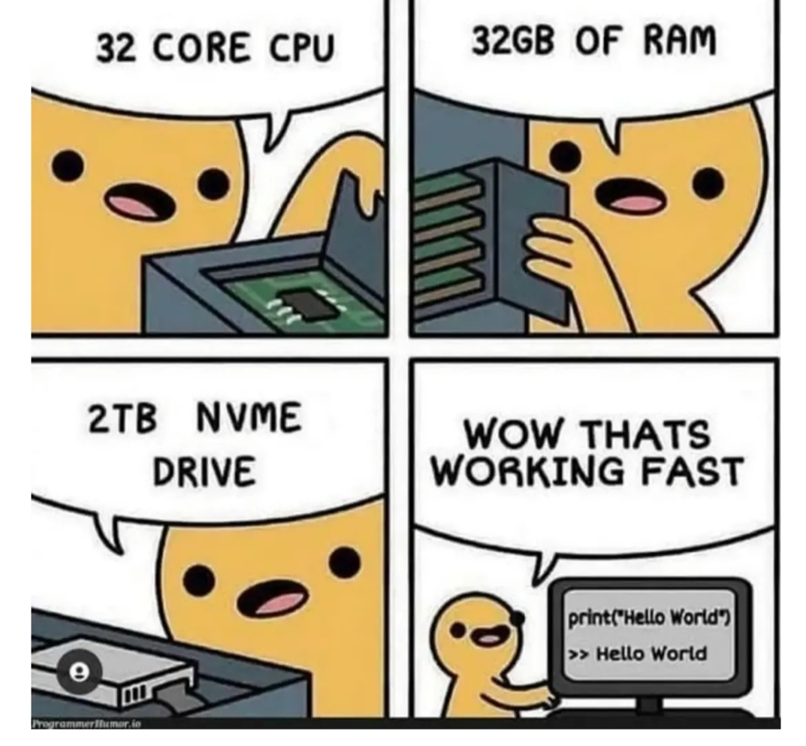
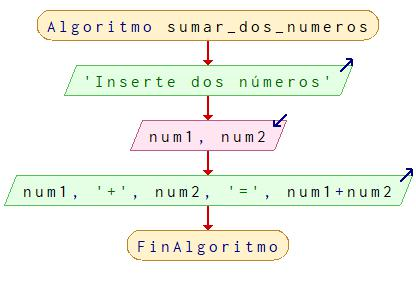
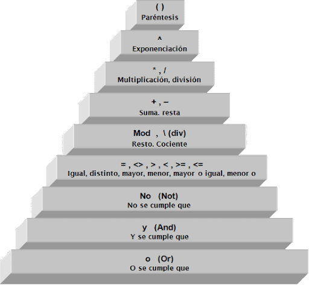
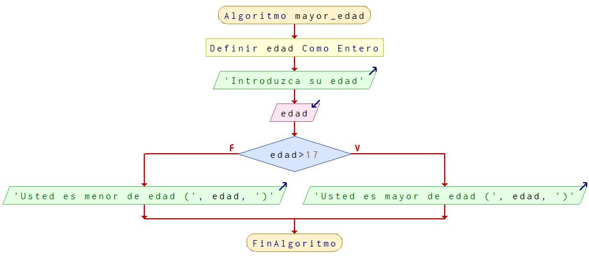
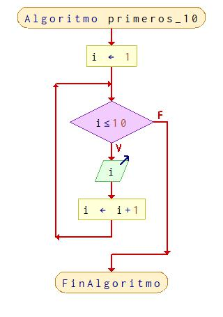
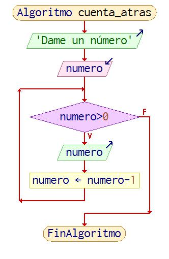
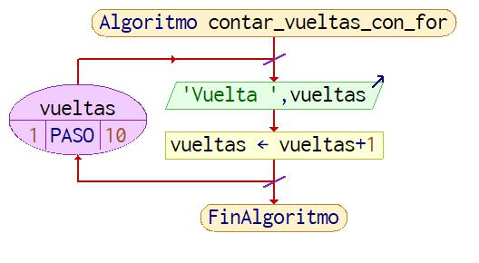

# Programación

[Classroom](https://classroom.google.com/c/NTg1NzY1NzA3NjIw?cjc=mnyl26c)



## Tabla de contenidos

- [Definicion de programación](#definición)
- [Coneptos básicos](#conceptos-básicos)
- [Pseudocódigo y diagramas de flujo](#pseudocódigo-y-diagramas-de-flujo)
- [Operadores](#operadores)
- [Escructura condicional](#condicionales-o-bifurcaciones)
- [Bucle while](#bucles-con-while)
- [Ejercicios básicos](#ejercicios-básicos)


## Definición

__Proceso__ de escribir o crear un conjunto de __instrucciones__ que le dicen a una computadora cómo __realizar una tarea__. 

¿Con esta definición __HTML__ es programar?

## Conceptos básicos

1. __Algoritmos__: Conjunto de pasos para realizar una tarea.
2. __Control de flujo__: Se trata de la forma en que una computadora determina qué instrucciones ejecutar a continuación.
3. __Expresión__ Cualquier valor devuelto
4. __Expresiones literales__: Valor devuelto de un dato sin necesidad de su almacenaje en una computadora. Ejemplos de expresiones literales: 

```js
3 // (number o numérico)
'Mi nombre' // (string o cadena de texto)
true // (boolean o lógico)
```

5. __Variable__ Espacio de memoria reservada para almacenar un dato
6. __Contante__ Espacio de memoria reservada para almacenar und dato. La diferencia fundamental con respecto a las variables es que una vez que reciben la asignación de un valor no se pueden volver a modificar
7. __Declaración__ Momento en el que reservamos espacio de memoria (creamos) una variable o constante
8. __Sentencia__ Instrucción dada a una computadora

[Inicio](#tabla-de-contenidos)

## Pseudocódigo y diagramas de flujo

Para __aprender a programar__ o con fines de __documentación de código__ existen diversas metodologías de programación. Nos centraremos en el __pseudocódigo__ y en los __diagramas de flujo__

### Pseudocógido

```psint
Algoritmo sumar_dos_numeros
	Escribir 'Inserte dos números'
	Leer num1, num2
	Escribir num1, '+', num2, '=', num1 + num2	
FinAlgoritmo
```
En la parte superior vemos un __pseudocógico__ que trata de resolver un __algoritmo__ que consiste en sumar dos números cualesquiera. Recuerda que un __algoritmo__ no es más que un conjunto de pasos que tiene como fin el de realzar una tarea.
Este conjunto de pasos debe de escribirse en __lenguajes de programación__ que sean entendibles para los humanos: los __lenguajes de alto nivel__. 

El __pseudocódigo__ es un "falso" lenguaje que trata de representar estos lenguajes de alto nivel

### Diagramas de flujo

Los __diagramas del flujo__ son una forma gráfica de representar los algoritmos:



La ejecución de este programa sería la siguiente:

<code>
*** Ejecución Iniciada. ***<br>
Inserte dos números<br>
> 2<br>
> 5<br>
2+5=7<br>
*** Ejecución Finalizada. ***
</code>

[Inicio](#tabla-de-contenidos)

## Operadores

A la hora de resolver problemas y realizar nuestros __algoritmos__ muchas veces no sólo con leer datos (__input__) y escribir datos (__output__). También es necesario realizar operaciones con ellos. A continuación detallamos algunos de los operadores que nos son necearios

### Operadores aritméticos

Con los números, puedes usar los operadores aritméticos para realizar operaciones matemáticas. Los más comunes son:

- suma (+)
- resta (-)
- multiplicación (*)
- división (/)
- módulo (resto de la división)
- exponente

Con las cadenas de texto:

- Concatenación (+)

### Operadores de comparación

En las __estructura de control__ condicinal que utilizaremos más adelante son necesarios los llamados __operadores de comparación__: >, <, >=, <=, ==, !=

Ejemplos:

```js
// Podemos comparar si un número es mayor que otro con el operador >, o si un número es menor que otro con el operador <.
5 > 3 // true
5 < 3 // false

// También tenemos los operadores >= y <= que nos permiten comparar si un número es mayor o igual que otro, o si un número es menor o igual que otro.
5 >= 3 // true
5 >= 5 // true
5 <= 3 // false
5 <= 5 // true

// Para saber si dos valores son iguales podemos usar el operador == o, para saber si son diferentes, el operador !=.

5 == 5 // true
5 != 5 // false
```

### Operadores lógicos

- El operador lógico __Y__ (AND) devolverá __verdadero__ (true) cuando ambos valores que conecta son true.

```js
// En JavaScript el operador lógico AND se escribe como &&
true && true // → true
true && false // → false
false && false // → false
```
- El operador lógico __O__ (OR) devolverá __verdadero__ (true) cuando cualquiera de los valores que conecta son true.

```js
// En JavaScript el operador lógico OR se escribe como ||
true || true // → true
true || false // → true
false || false // → false
```

- El operador lógico NO (NOT) invierte el valor de un valor booleano. Se pone delante del valor que queremos invertir. 

```js
// En JavaScript el operador lógico NOT se escribe como !
!true // → false
!false // → true
```
[Inicio](#tabla-de-contenidos)

### Prioridad de operadores



- 13 - 4 · (5 - 2) + 3 · (2 + 8)
- 16 + 3 · (6 - 4) - 3 · 5 
- 23 - 8 + 6 · 2 - 3 · 4
- 6 · (7 · 5 - 4 · 6) + 81 : 9 - 6
- 23 - 5 · (6 - 2) + 9
- 4 · 3 + 7 - 2 · 4 + 3 · (9 - 5)
- 6 · 4 + 3 AND -1
- 3 · (5 + 4) - 6 + 3 · (8 - 4)
- 8 · (3 + 6) - 7 · (2 + 3)
- 6 + 3 · 5 - 4 · (7 - 2)
- 4 · (7 + 2) - 3 · 9
- 5 · 6 : 2 - (12 - 3) · 2
- 3 · 9 + 7 + 6 - 5 · 3
- 5 · (2 + 6) + 7 - 4 · 3
- 6 · 7 - 4 · 6 + 8 - 3
- 23 - 5 · (6 - 2) + 9
- 4 · 3 + 7 - 2 · 4 + 3 · (9 - 5)
- 40 - (15 - 6 - 8) - 10
- 5 · 7 + 5 · 2 - 5 · 4 + 5 · 10 - 5 · 3 + 5 · 12 OR false

## Condicionales o bifurcaciones

En la __programación estructurada__ el código es lineal, esto es, instrucción a instrucción. Pero eso no quita que a veces haya que tomar decisiones.

Obsérvese el siguiente diagrama:



El pseudocódigo del mismos sería:

```psint
Algoritmo mayor_edad
	Definir edad como Entero
	Escribir 'Introduzca su edad'
	Leer edad
	Si edad > 17 Entonces
		Escribir 'Usted es mayor de edad (', edad,')'
	SiNo
		Escribir 'Usted es menor de edad (', edad,')'
	FinSi
FinAlgoritmo
```

Y un ejemplo de ejecución del programa:

<code>
*** Ejecución Iniciada. ***<br>
Introduzca su edad<br>
> 50<br>
Usted es mayor de edad (50)<br>
*** Ejecución Finalizada. ***
</code>

Como observamos en una __bifurcación__ más conocido como __condicional__ esperamos una decisión, esto es, se evalúa una __expresión a verdadero o falso__. Las condicionales también se denominan estructuras de control

[Inicio](#tabla-de-contenidos)

## Bucles

Un __bucle__ es una _estructura de control_ que permite _repetir un bloque_ de instrucciones. Vamos, repetir una tarea tantas veces como queramos.



### while

El __bucle while__ es una __estructura de control__ de flujo que ejecuta una sección de código __mientras se cumple una determinada condición__, esto es simpre y cuando la estructura de control sea __true__.

La naturaleza de un bucle __while__ provoca que éste quizás _nunca se ejecute_.

En el siguiente ejemplo qué ocurría si el usuario introduce un cero como número:



### do...while

Muy parecido al bucle __while__ salvo por el hecho de que las instrucciones se ejecutan por lo menos una vez.

Obsérvese el siguiente __algoritmo__ en PSeInt:

```
Algoritmo dame_nombre
	Repetir
		Escribir 'Dame tu nombre: '
		Leer nombre
	Hasta Que nombre<>''
	Escribir 'Tu nombre es ',nombre
FinAlgoritmo
```
Y el diagrama:


Se puede observar claramente que las instrucciones se repiten por lo menos una vez. El usuario por lo menos tiene un intento de introducir su nombre.

### For

El bucle __for__ es unas __estructura de control__ que nos facilita escribir en menos líneas un bucle (sea __while__ o __do...while__). Fijarse en el siguiente _pseudocódigo_:

```
Algoritmo contar_vueltas_con_for
	Para vueltas = 1 Hasta 10 Con Paso paso Hacer
		Escribir "Vuelta ", vueltas
		vueltas = vueltas + 1
	Fin Para
FinAlgoritmo
```

Observamos que en la instrucción __Para__ _inicializamos_ las vueltas e indicamos el _final_ de la condición (__Hasta 10__) en la misma línea de la __sentencia__ o __instrucción__.

El diagrama sería el siguiente:



[Inicio](#tabla-de-contenidos)

## Ejercicios básicos

1.  Diagrama de flujo que a partir de tres notas de evaluación dadas de un determiando alumno en la asignatura de "Programación" se obtenga la media aritmética de estas
2. Diagrama de flujo introducido el precio de un producto se le aplique descuento del quince por ciento obteniendo el desglose del descuento y el precio final
3. Diagrama de flujo en el que determinemos dado un número si este es positivo o negativo
4. Leer un número y determinar si este es par o impar
5. Leer dos números y determinar si el primero es mayor que el segundo. En caso de que no sea así intercambiar los valores con una variable auxiliar

- [Soluciones](./ejercicios-basicos.md)

## [Prueba de conocimientos](./prueba-conocimientos.md)

## Ejercicios de refuerzo

1. Dados dos números reales, __a__ y __b__, y el símbolo, __S__ (carácter), de un operador
aritmético (+, -, *, /), imprimir el resultado de la operación __a__ __S__ __b__
2. Comprobar si un año es bisiesto. Los años divisibles por 4 son bisiestos, pero cada 400 años se deben eliminar 3 bisiestos. Para ello, no son bisiestos los que se dividen por 100, menos los que se dividen por 400, que sí son bisitestos.
Dicho de otro modo, son bisiestos todos los años divisibles por 4, excluyendo los que sean divisibles por 100, pero no los que sean divisibles por 400.

## Bucles
1. Mostrar los primeros 10 números naturales impares
2. Sumar los números del 1 al 10
3. Imprimir la tabla de multiplicar de 1 al 10
4. Algoritmo en el que un usuario introduzca 50 números y al final se muestre cuántos son números positivos, cuántos negativos y cuántos cero
5. En __PseInt__ con esta instrucción <code> n = azar(10) + 1</code> obtenemos un número aleatorio entre 1 y 10. Realizar un algoritmo donde un usuario tenga 10 intentos para adivinar un número aleatorio entre 1 y 100. Por cada intento se le dará la pista si el número propuesto es mayor o menor que el número aleatorio generado.
6. Tenemos la pantalla del móvil bloqueada. Partiendo de un PIN_SECRETO, intentaremos desbloquear la pantalla. Tenemos hasta 3 intentos. Simula el proceso. En caso de acceder, lanza al usuario 'login correcto'. Sino, 'llamando al policía'.
7. Calcular el factorial de un número. Por ejemplo:

	```
	3! o factorial de 3
	3 * 2 * 1 = 6
	```

8. Crea un algoritmo que dibuje un árbol dado un número, asumiendo que n >1. Para n = 3:

	```
	*
	**
	***
	```

9.  Vamos a diseñar una calculadora que se enciende y hasta que no tecleamos 'SAL' no se apaga. Esta calculadora funciona de la siguiente manera:
	- Recogemos los datos A y B
  - Si operación es 1 calcula A / B. Vigilamos que B no sea 0...
  - Si la operación es 2 calculamos la siguiente fórmula: ( A * B ) / 2.5


Para ver la soluciones cambia al <mark>branch</mark> __solutions__.

## Recursos y enlaces

- [PSeInt](https://pseint.sourceforge.net/)
- [Curso básico de JavaScript](https://github.com/webferrol/programming-session/tree/solutions/soluciones)

[Inicio](#tabla-de-contenidos)

