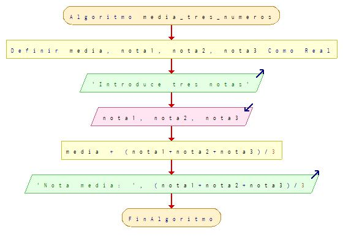
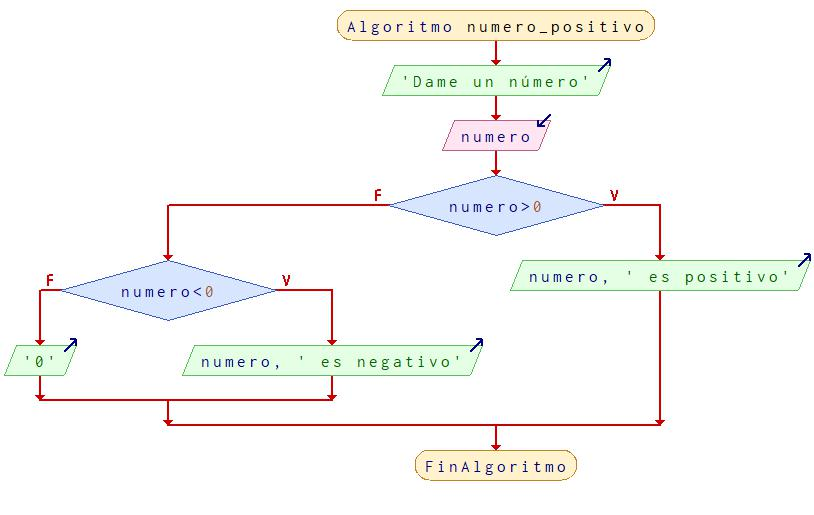
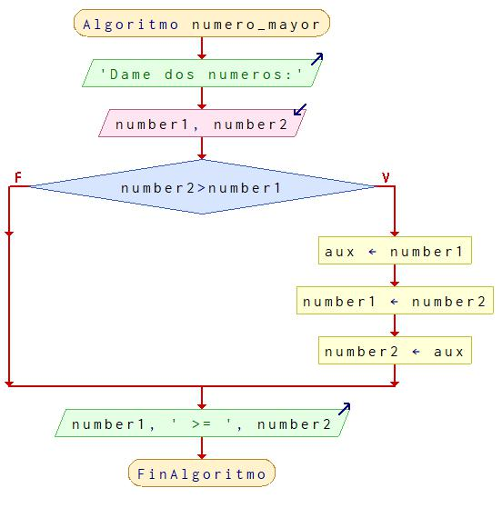

# Ejercicios básicos

## Diagrama de flujo que a partir de tres notas de evaluación dadas de un determiando alumno en la asignatura de "Programación" se obtenga la media aritmética de estas



## Algoritmo de un programa que a partir de un precio de un producto se le aplique descuento del quince por ciento obteniendo el desglose del descuento y el precio final

```
Algoritmo descuento_ejercicio_02
	Definir precio, descuento Como Real
	Escribir 'Introduzca un precio'
	Leer precio
	descuento <- precio * 0.15
	Escribir 'Precio del producto: ', precio
	Escribir 'Descuento: ', descuento
	Escribir 'Total: ', precio * 0.85
FinAlgoritmo
```
## Diagrama de flujo en el que determinemos dado un número si este es positivo o negativo



## Leer un número y determinar si este es par o impar

```
Algoritmo par_impar
	Escribir 'Dame un número'
	Leer numero
	Si numero % 2 == 0
		Escribir numero, ' es par'
	SiNo
		Escribir numero, ' es impar'
	FinSi
FinAlgoritmo
```

## Leer dos números y determinar si el primero es mayor que el segundo. En caso de que no sea así intercambiar los valores con una variable auxiliar

